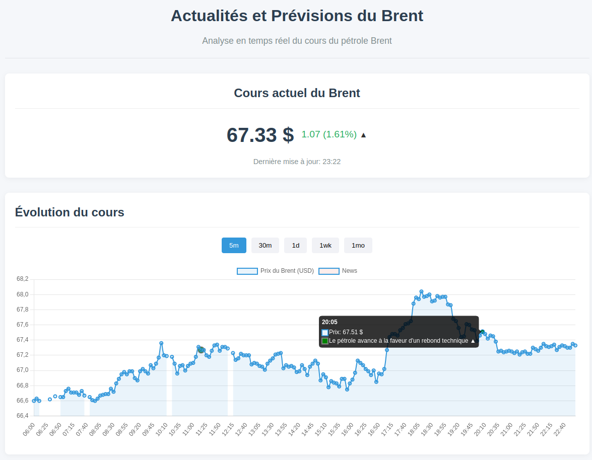
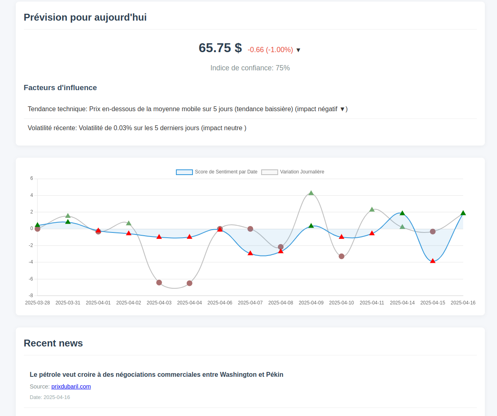
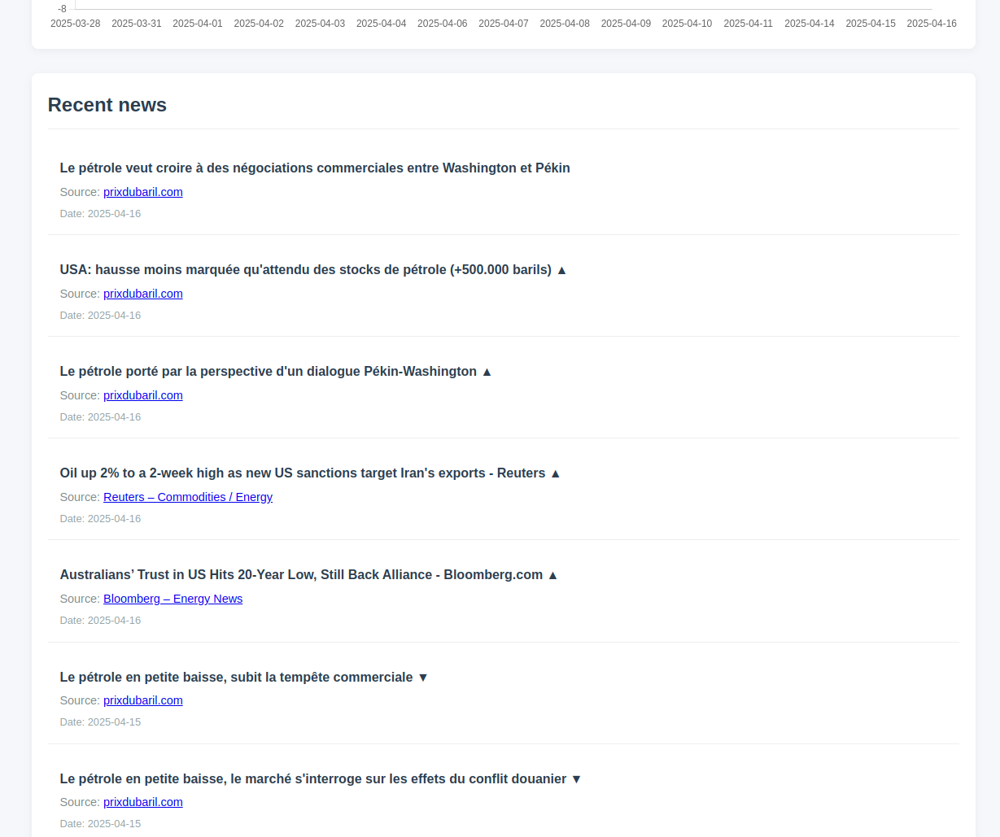

# Application de Prévision du Cours du Brent en fonction des actualités uniquement

Cette application permet de suivre l'évolution du cours du pétrole Brent et de générer des prévisions basées sur les données historiques et l'analyse d'actualités.

## Fonctionnalités

- Affichage en temps réel du cours du Brent
- Visualisation de l'historique des prix pour différentes périodes (1j, 5j, 1m, 6m, 1a)



- Prévision automatique de l'évolution du cours



- Analyse des actualités récentes et leur impact sur le prix



- Indicateurs techniques et niveau de confiance des prévisions

## Architecture

L'application est structurée en deux parties principales :

1. **Backend (Node.js)**
   - Récupération des données depuis Yahoo Finance
   - Analyse des actualités 
   - Génération des prévisions
   - API REST pour servir les données au frontend

2. **Frontend (HTML/CSS/JavaScript)**
   - Interface utilisateur responsive
   - Graphiques interactifs avec Chart.js
   - Affichage des actualités et des prévisions
   - Communication avec le backend via les API REST

## Sources d'actualités

Les actualités dont on mesure l'impact sur le cours du Brent sont récupérées via des flux RSS/Atom, configurés dans `NEWS_SOURCES` (`src/api/newsAnalyzer.js`) :

| Source | Accès |
|---|---|
| [prixdubaril.com](https://prixdubaril.com) | Flux Atom direct (`news-petrole.feed`) |
| [Reuters](https://www.reuters.com) | Google News RSS, requête `brent` restreinte à `reuters.com` |
| [Bloomberg](https://www.bloomberg.com) | Google News RSS, requête `brent` restreinte à `bloomberg.com` |
| Economics.com | Google News RSS, requête `brent` restreinte à `economics.com` |
| [Financial Times](https://www.ft.com) | Google News RSS, requête `brent` restreinte à `ft.com` |
| Petrobazaar | Google News RSS, requête `brent` restreinte à `petrobazaar.com` |

Les requêtes Google News portent sur les dernières 24 h. Le sentiment de chaque titre est ensuite évalué avec VADER (`src/python/vadersSentiment.v2.py`).

Sources présentes dans le code mais désactivées (commentées) : Investing.com (Commodities), OilPrice.com et U.S. Energy Information Administration (EIA).

## Installation

### Prérequis

- Node.js (v14+)
- npm (v6+)

### Installation des dépendances

```bash
# Cloner le dépôt
git clone https://github.com/actu-bourse-prevision/actu-bourse-prevision.git
cd actu-bourse-prevision

# Installer les dépendances
npm install
```

## Démarrage

### Mode développement

```bash
npm run dev
```

Cette commande démarre le serveur avec nodemon qui surveille les modifications et redémarre automatiquement.

### Mode production

```bash
npm start
```

L'application sera disponible à l'adresse http://localhost:3001.

## Structure du projet

```
/
├── public/               # Fichiers statiques (frontend)
│   ├── index.html        # Page HTML principale
│   ├── style.css         # Styles CSS
│   └── src/              # Code JavaScript frontend
│       ├── app.browser.js # Application frontend
│       └── ...
├── src/                  # Code source backend
│   ├── api/              # Modules d'API
│   │   ├── yahooFinance.js # API Yahoo Finance
│   │   ├── newsAnalyzer.js # Analyseur d'actualités
│   │   └── predictionEngine.js # Moteur de prédiction
│   └── app.js            # Application principale
└── index.js              # Point d'entrée du serveur
```

## Technologies utilisées

- **Backend**: Node.js, Express, Axios
- **Frontend**: HTML5, CSS3, JavaScript, Chart.js
- **Données**: Yahoo Finance API (cours), flux RSS/Atom d'actualités (voir « Sources d'actualités »)
- **Analyse de sentiment**: Python, VADER

## Interface utilisateur

L'interface utilisateur est divisée en plusieurs sections :

1. **Cours actuel du Brent** : Affiche le prix actuel du Brent avec sa variation par rapport à la veille.

2. **Évolution du cours** : Graphique montrant l'évolution du cours du Brent sur différentes périodes. Vous pouvez changer la période en cliquant sur les boutons (1J, 5J, 1M, 6M, 1A).

3. **Prévision pour aujourd'hui** : Affiche la prévision du cours du Brent pour la journée, avec la variation attendue et un indice de confiance. Les facteurs d'influence sont également listés.

4. **Actualités récentes** : Liste des actualités récentes concernant le Brent, avec leur source et leur date.

## API REST

Le serveur expose les API REST suivantes :

- `GET /api/all-data?period=1d` : Récupère toutes les données (prix, historique, actualités, prévision)
- `GET /api/historical-data?period=1d` : Récupère les données historiques pour une période donnée
- `GET /api/current-price` : Récupère le prix actuel du Brent
- `GET /api/news` : Récupère les actualités récentes
- `POST /api/prediction` : Génère une prévision basée sur les données historiques et les actualités

## Limitations et améliorations possibles

- Les prévisions sont générées à partir de données historiques et d'actualités, mais ne constituent pas des conseils d'investissement
- La précision des prévisions dépend de nombreux facteurs externes qui ne peuvent pas tous être pris en compte
- L'analyse de sentiment ne porte que sur les titres des actualités et pourrait être enrichie (contenu complet des articles, modèle spécialisé finance)
- Ajout de plus de facteurs d'influence dans l'algorithme de prévision
- Implémentation d'un modèle d'apprentissage automatique pour améliorer la précision des prévisions

## Avertissement

⚠️ Projet de test uniquement : Cette application a été développée à des fins de démonstration ou d’expérimentation personnelle. Les prévisions générées ne doivent en aucun cas être interprétées comme des conseils financiers ou d’investissement.

L’auteur décline toute responsabilité quant à l’usage qui pourrait être fait des informations fournies par ce projet.

## Licence

ISC
